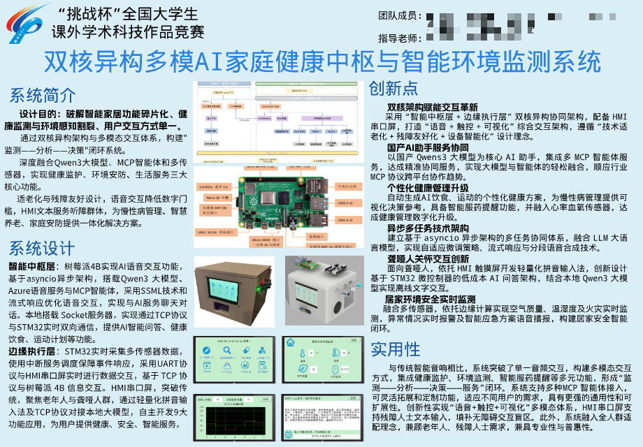
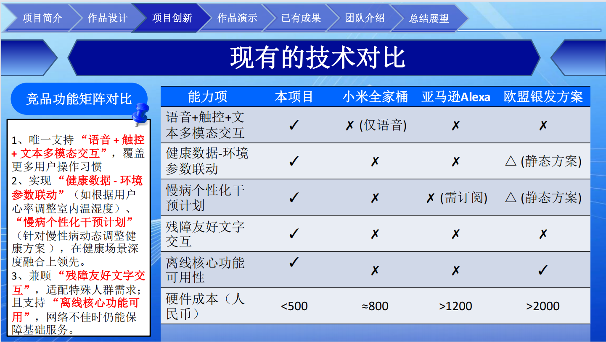

# RaspberryPi-STM32-AI-Smart-Butler
双核异构多模AI家庭健康中枢耗时数月打造的智能居家系统！基于树莓派4B+STM32F103ZET6双核异构架构，融合通义千问大模型、多传感器与MCP智能体，实现健康监护、环境监测、智能服药提醒、语音/文本多模态交互全功能！适配适老化+残障友好设计，聋哑人群可通过HMI屏文字对话大模型，老年人语音就能搞定健康管理/服药提醒，还能实时监测空气质量、火灾风险并智能告警，7日心率血氧可视化、个性化饮食运动计划一键生成～ 从硬件电路设计、软件编程到系统集成全自主开发，真正实现“监测-分析-决策-服务”智能闭环，把AI健康管家搬进家！
* 项目成果：第二十届港澳地区计算机作品创新大赛二等奖、第八届传智杯AIoT嵌入式系统创新大赛一等奖、第十九届"挑战杯"全国大学生课外学术科技作品"人工智能+"应用赛国赛
## 项目目录说明

```text
├── 3D建模工程
├── HMI串口屏工程
├── bom清单
├── 基于STM32的硬件原理图
├── 源代码
└── README.md
```

### 目录说明

- `3D建模工程`：存放项目外壳、结构件等 3D 建模文件。
- `HMI串口屏工程`：存放 HMI 串口屏界面设计工程文件。
- `bom清单`：存放项目所需元器件清单。
- `基于STM32的硬件原理图`：存放 STM32 控制板及相关硬件电路原理图。
- `源代码`：存放 STM32、树莓派及相关模块的程序源码。
- `README.md`：项目说明文档。

---

### 项目简介




### 产品优势


#
## 使用说明

1. 下载或克隆本项目：

```bash
git clone https://github.com/zhengzhaolin-zzl/RaspberryPi-STM32-AI-Smart-Butler.git
```
2. 打开树莓派程序，到阿里云百炼平台创建一个Qwe235b的api，再到微软Azure创建一个语音服务的示例获取api，最后，补充到AI.env里

3. 打开 `源代码` 文件夹，分别烧录 STM32 程序和部署树莓派程序。

4. 打开 `HMI串口屏工程`，将界面工程下载到 HMI 串口屏。

5. 按照 `基于STM32的硬件原理图` 完成硬件连接。

6. 上电运行系统，测试各模块功能。

---
